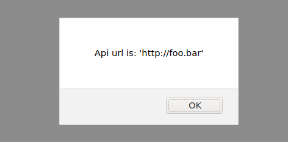
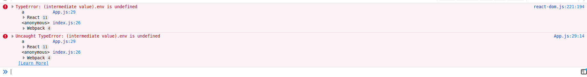
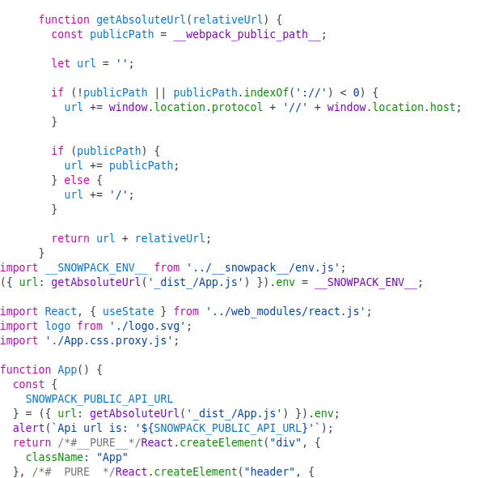

# snowpack-test

> Sample app for showing problems with environment variables using `snowpack` and `@snowpack/plugin-webpack`

### npm start

Run the example with plain `snowpack`, i.e. not bundling anything. Should alert the following:



### npm run serve

Builds a static copy of your site to the `build/` folder using `@snowpack/plugin-webpack` and serves it with `serve`.

The console should show something similar to:



Checking the built code should show something like:



In particular this line looks a bit weird:

```js
const { SNOWPACK_PUBLIC_API_URL } = ({ url: getAbsoluteUrl('_dist_/App.js') }).env;
```

The code is trying to access the `.env` property on an object which clearly doesn't have that property set. It looks like something is missing.


